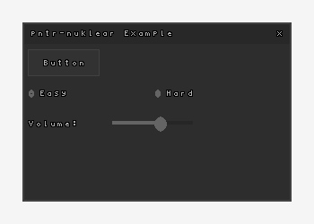

# pntr-nuklear

[Nuklear](https://github.com/Immediate-Mode-UI/Nuklear) immediate-mode graphical user interface for [pntr](https://github.com/robloach/pntr).



## Usage

``` c
// Initialize
pntr_font* font = pntr_load_font_default();
struct nk_context* ctx = pntr_load_nuklear(font);

// Nuklear GUI Code
if (nk_begin(ctx, "Hello World", nk_rect(50, 50, 200, 150),
                NK_WINDOW_BORDER|NK_WINDOW_MOVABLE|NK_WINDOW_CLOSABLE)) {
    // Widget code here
}
nk_end(ctx);

// Render
pntr_draw_nuklear(dst, ctx);

// Unload
pntr_unload_nuklear(ctx);
pntr_unload_font(font);
```

## License

Unless stated otherwise, all works are:

- Copyright (c) 2023 [Rob Loach](https://robloach.net)

... and licensed under:

- [zlib License](LICENSE)
